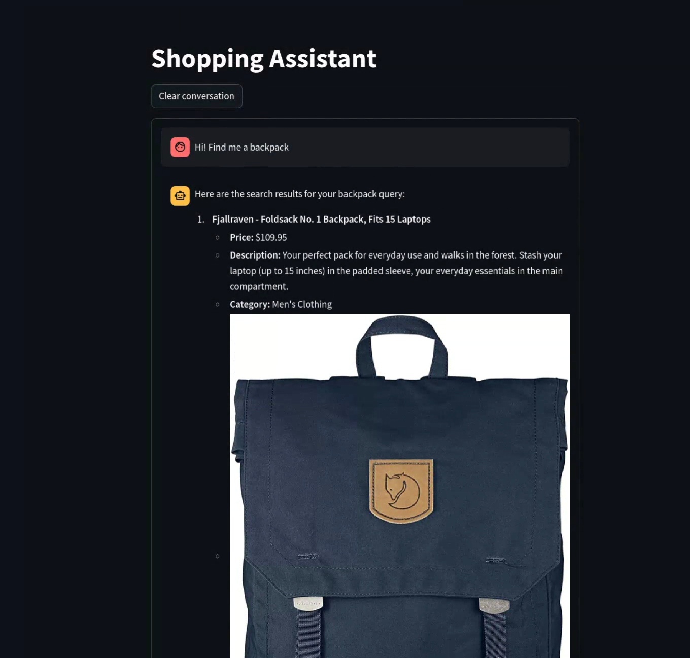

# 🛍️ E-Commerce RAG Assistant

A prototype AI shopping assistant powered by Retrieval-Augmented Generation (RAG) to help customers find products.



## 🚀 Features

- **Conversational AI**: Friendly, context-aware assistant that understands natural language queries
- **RAG Architecture**: Accurately retrieves product information to provide informed responses
- **Simple Interface**: Clean Streamlit UI for seamless interaction

## 🛠️ Technology Stack

- **AI Models**: OpenAI's GPT-4o-mini for chat and text-embedding-3-small for embeddings
- **Vector Search**: Custom numpy vector index for product retrieval
- **Frontend**: Streamlit for interactive web interface
- **Data**: SQLite database with sample product catalog

## 🏃‍♂️ Getting Started

1. Clone the repository
2. Install dependencies with Poetry: `poetry install`
3. Add your OpenAI API key to a `.env` file
4. Run the app: `poetry run streamlit run rag_assistant/app/app.py`

## 📁 Project Structure

```
rag_assistant/
├── app/            # Streamlit application
├── database/       # Product database implementation
├── llm/            # LLM agents and chat interfaces
└── retrieval/      # Vector embeddings and search
```

## 🧪 Testing

Run the test suite with:

```bash
poetry run pytest
```

## 🔮 Future Development

- PostgreSQL database with SQLModel for scalable data management
- Weaviate for production-grade vector search
- Logfire for comprehensive observability and analytics
- Expanded product catalog and advanced query capabilities

## 📝 License

MIT